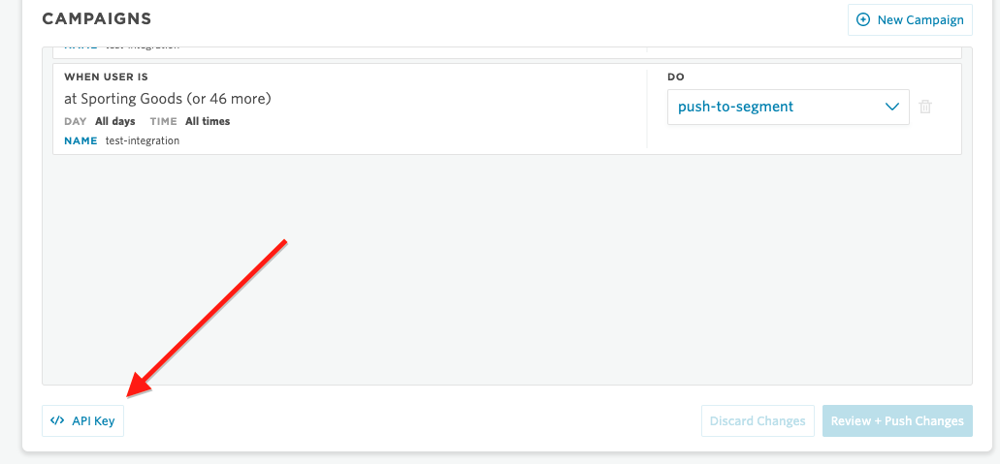

# Example

## Setup

### Add API Keys

**(1)** Locate your Factual Engine API Key from the [Factual Engine Dashboard](https://engine.factual.com/garage)

**(2)** Add your Factual Location Engine API Key in [Configuration.java](https://github.com/Factual/engine-segment-integration-android/tree/master/example/src/main/java/com/factual/engine/segment/Configuration.java#L5)

**(3)** Locate your Segment API Key for your app from the [Segment Dashboard](https://dashboard.braze.com).  In **Sources** select your app, open the **settings** tab, and select **API Keys**.

**(4)** Add your Segment Write API Key to [Configuration.java](https://github.com/Factual/engine-segment-integration-android/tree/master/example/src/main/java/com/factual/engine/segment/Configuration.java#L6)

### Explore

From here you can use Engine to send data to Segment to be processed and pushed to your various destinations.

### Testing

If you'd like to test the integration, an example test is given.  This example test sends data to Segment, then uses Segment to push that data to [Braze](https://www.braze.com). To run the test you must have a Braze API key and endpoint.  Fill out your information in [StubConfiguration.java](https://github.com/Factual/engine-segment-integration-android/tree/master/example/src/androidTest/java/com/factual/engine/segment/StubConfiguration.java).  You may also change the test to send data to your own destination and verify its being sent in a similar way.
